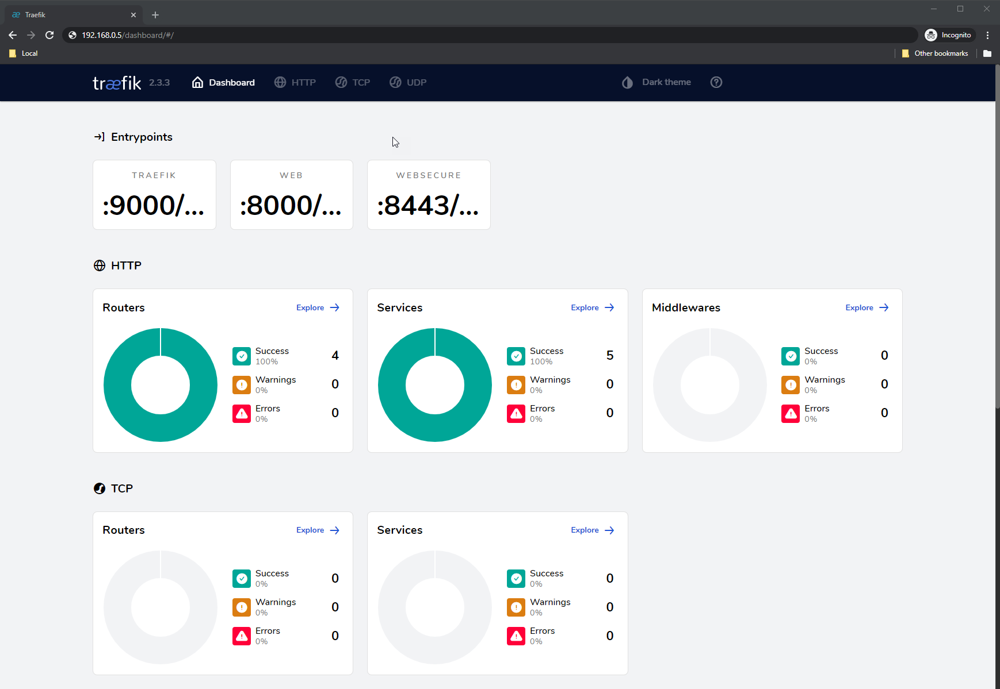

# Installing the Traefik Ingress Controller on k0s

In this tutorial, you'll learn how to configure k0s with the
[Traefik ingress controller](https://doc.traefik.io/traefik/providers/kubernetes-ingress/),
a [MetalLB service loadbalancer](https://metallb.universe.tf/),
and deploy the Traefik Dashboard along with a service example.
Utilizing the extensible bootstrapping functionality with Helm, 
it's as simple as adding the right extensions to the `k0s.yaml` file 
when configuring your cluster.


## Configuring k0s.yaml

Modify your `k0s.yaml` file to include the Traefik and MetalLB helm charts as extensions,
and these will install during the cluster's bootstrap.

> Note: You may want to have a small range of IP addresses that are addressable on your network,
preferably outside the assignment pool allocated by your DHCP server.
Providing an addressable range should allow you to access your LoadBalancer and Ingress services
from anywhere on your local network.
However, any valid IP range should work locally on your machine.

```yaml
extensions:
  helm:
    repositories:
    - name: traefik
      url: https://helm.traefik.io/traefik
    - name: bitnami
      url: https://charts.bitnami.com/bitnami
    charts:
    - name: traefik
      chartname: traefik/traefik
      version: "9.11.0"
      namespace: default
    - name: metallb
      chartname: bitnami/metallb
      version: "1.0.1"
      namespace: default
      values: |2
        configInline:
          address-pools:
          - name: generic-cluster-pool
            protocol: layer2
            addresses:
            - 192.168.0.5-192.168.0.10
```

Providing a range of IPs for MetalLB that are addressable on your LAN is suggested 
if you want to access LoadBalancer and Ingress services from anywhere on your local network.

## Retrieving the Load Balancer IP

Once you've started your cluster, you should confirm the deployment of Traefik and MetalLB.
Executing a `kubectl get all` should include a response with the `metallb` and `traefik` resources, 
along with a service loadbalancer that has an `EXTERNAL-IP` assigned to it. 
See the example below:

```bash
root@k0s-host ➜ kubectl get all
NAME                                                 READY   STATUS    RESTARTS   AGE
pod/metallb-1607085578-controller-864c9757f6-bpx6r   1/1     Running   0          81s
pod/metallb-1607085578-speaker-245c2                 1/1     Running   0          60s
pod/traefik-1607085579-77bbc57699-b2f2t              1/1     Running   0          81s

NAME                         TYPE           CLUSTER-IP       EXTERNAL-IP      PORT(S)                      AGE
service/kubernetes           ClusterIP      10.96.0.1        <none>           443/TCP                      96s
service/traefik-1607085579   LoadBalancer   10.105.119.102   192.168.0.5      80:32153/TCP,443:30791/TCP   84s

NAME                                        DESIRED   CURRENT   READY   UP-TO-DATE   AVAILABLE   NODE SELECTOR            AGE
daemonset.apps/metallb-1607085578-speaker   1         1         1       1            1           kubernetes.io/os=linux   87s

NAME                                            READY   UP-TO-DATE   AVAILABLE   AGE
deployment.apps/metallb-1607085578-controller   1/1     1            1           87s
deployment.apps/traefik-1607085579              1/1     1            1           84s

NAME                                                       DESIRED   CURRENT   READY   AGE
replicaset.apps/metallb-1607085578-controller-864c9757f6   1         1         1       81s
replicaset.apps/traefik-1607085579-77bbc57699              1         1         1       81s
```

Take note of the `EXTERNAL-IP` given to the `service/traefik-n` LoadBalancer.
In this example, `192.168.0.5` has been assigned and can be used to access services via the Ingress proxy:

```bash
NAME                         TYPE           CLUSTER-IP       EXTERNAL-IP      PORT(S)                      AGE
service/traefik-1607085579   LoadBalancer   10.105.119.102   192.168.0.5      80:32153/TCP,443:30791/TCP   84s
# Recieving a 404 response here is normal, as you've not configured any Ingress resources to respond yet
root@k0s-host ➜ curl http://192.168.0.5
404 page not found
```

## Deploy and access the Traefik Dashboard

Now that you have an available and addressable load balancer on your cluster, 
you can quickly deploy the Traefik dashboard and access it from anywhere on your local network 
(provided that you configured MetalLB with an addressable range).

Create the Traefik Dashboard [IngressRoute](https://doc.traefik.io/traefik/providers/kubernetes-crd/) 
in a YAML file:

```yaml
apiVersion: traefik.containo.us/v1alpha1
kind: IngressRoute
metadata:
  name: dashboard
spec:
  entryPoints:
    - web
  routes:
    - match: PathPrefix(`/dashboard`) || PathPrefix(`/api`)
      kind: Rule
      services:
        - name: api@internal
          kind: TraefikService
```

Next, deploy the resource:

```bash
root@k0s-host ➜ kubectl apply -f traefik-dashboard.yaml
ingressroute.traefik.containo.us/dashboard created
```

Once deployed, you should be able to access the dashboard using the `EXTERNAL-IP` 
that you noted above by visiting `http://192.168.0.5` in your browser:



Now, create a simple `whoami` Deployment, Service, 
and [Ingress](https://kubernetes.io/docs/concepts/services-networking/ingress/) manifest:

```yaml
apiVersion: apps/v1
kind: Deployment
metadata:
  name: whoami-deployment
spec:
  replicas: 1
  selector:
    matchLabels:
      app: whoami
  template:
    metadata:
      labels:
        app: whoami
    spec:
      containers:
      - name: whoami-container
        image: containous/whoami
---
apiVersion: v1
kind: Service
metadata:
  name: whoami-service
spec:
  ports:
  - name: http
    targetPort: 80
    port: 80
  selector:
    app: whoami
---
apiVersion: networking.k8s.io/v1
kind: Ingress
metadata:
  name: whoami-ingress
spec:
  rules:
  - http:
      paths:
      - path: /whoami
        pathType: Exact
        backend:
          service:
            name: whoami-service
            port:
              number: 80
```

Once you've created this, apply and test it:

```bash
# apply the manifests
root@k0s-host ➜ kubectl apply -f whoami.yaml
deployment.apps/whoami-deployment created
service/whoami-service created
ingress.networking.k8s.io/whoami-ingress created
# test the ingress and service
root@k0s-host ➜ curl http://192.168.0.5/whoami
Hostname: whoami-deployment-85bfbd48f-7l77c
IP: 127.0.0.1
IP: ::1
IP: 10.244.214.198
IP: fe80::b049:f8ff:fe77:3e64
RemoteAddr: 10.244.214.196:34858
GET /whoami HTTP/1.1
Host: 192.168.0.5
User-Agent: curl/7.68.0
Accept: */*
Accept-Encoding: gzip
X-Forwarded-For: 192.168.0.82
X-Forwarded-Host: 192.168.0.5
X-Forwarded-Port: 80
X-Forwarded-Proto: http
X-Forwarded-Server: traefik-1607085579-77bbc57699-b2f2t
X-Real-Ip: 192.168.0.82
```

## Summary

From here, it's possible to use 3rd party tools, such as [ngrok](https://ngrok.io),
to go further and expose your LoadBalancer to the world.
Doing so then enables dynamic certificate provisioning through [Let's Encrypt](https://letsencrypt.org/)
utilizing either [cert-manager](https://cert-manager.io/docs/)
or Traefik's own built-in [ACME provider](https://doc.traefik.io/traefik/v2.0/user-guides/crd-acme/).
This guide should have given you a general idea of getting started with Ingress on k0s
and exposing your applications and services quickly.